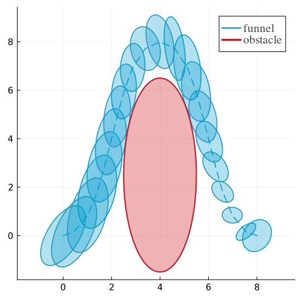

# Funnel using Copositivity LMI Conditions
###  How to Run
To execute the script and see results, use the following command:
```
julia run_result.jl
```
### Output Example
When you run the script, you will see output similar to this:
```
============ Line search for lambda_w ==============
lambda_w: 0.01 cost: diverged
lambda_w: 0.1 cost: diverged
lambda_w: 0.2 cost: diverged
lambda_w: 0.3 cost: diverged
lambda_w: 0.4 cost: -1.6146634651615779
lambda_w: 0.5 cost: -1.2677957110849758
lambda_w: 0.6 cost: -0.9375495294408782
lambda_w: 0.7 cost: -0.668375134455112
lambda_w: 0.8 cost: -0.4516073113167959
lambda_w: 1.0 cost: -0.08499232120706683
lambda_w: 1.2 cost: diverged
lambda_w: 1.4 cost: diverged
lambda_w: 1.6 cost: diverged
lambda_w: 1.8 cost: diverged
lambda_w: 2.0 cost: diverged
0.4 is picked
======== First copositive condition ========
lambda_w: 0.4 cost: -1.6146634651615779 solve time 1.6425070762634277
======== Second copositive condition ========
lambda_w: 0.4 cost: -1.6695095445502524 solve time 8.342612028121948
```
### Generated Figure
The script also generates and saves a figure to ./funnels.png, which illustrates the results of the funnels.

The preview of the generated figure is




