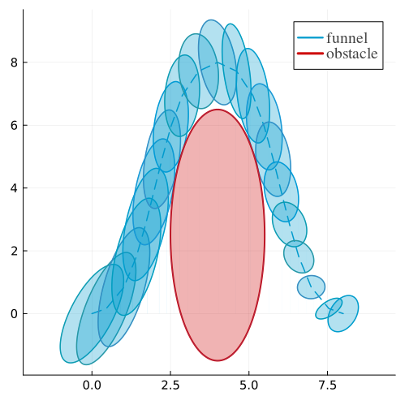

# Funnel using Copositivity LMI Conditions
###  How to Run
To execute the script and see results, use the following command:
```
julia run_result.jl
```
### Output Example
When you run the script, you will see output similar to this:
```
============ Line search for lambda_w ==============
lambda_w: 0.01 cost: diverged
lambda_w: 0.1 cost: diverged
lambda_w: 0.2 cost: diverged
lambda_w: 0.3 cost: -2.9688720423906876
lambda_w: 0.4 cost: -2.3676169371262916
lambda_w: 0.5 cost: -1.7733578432040027
lambda_w: 0.6 cost: -1.3306349270016562
lambda_w: 0.7 cost: -1.000456781445645
lambda_w: 0.8 cost: -0.7488982249417353
lambda_w: 1.0 cost: -0.3726782425864384
lambda_w: 1.2 cost: 0.04401437311050141
lambda_w: 1.4 cost: diverged
lambda_w: 1.6 cost: diverged
lambda_w: 1.8 cost: diverged
lambda_w: 2.0 cost: diverged
0.3 is picked
======== First copositive condition ========
lambda_w: 0.3 cost: -2.9688720423906876 solve time 0.30774497985839844
======== Second copositive condition ========
lambda_w: 0.3 cost: -3.0321508863107156 solve time 0.6913230419158936
```
### Generated Figure
The script also generates and saves a figure to ./funnels.png, which illustrates the results of the funnels.

The preview of the generated figure is




